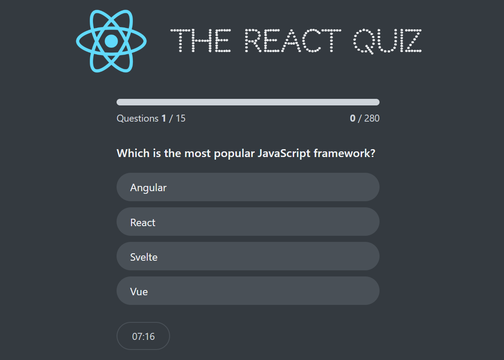

<h1 style="text-align: center;">React Quiz App</h1>


## 📸 Screenshots

Here are some previews of the **React Quiz App** in action:

<p align="center">
  
</p>

## 🚀 Tech Stack & Badges

| Technology | Badge                                                                                             |
| ---------- | ------------------------------------------------------------------------------------------------- |
| React      |                |
| JavaScript |  |
| HTML5      |                     |
| CSS3       |                        |
| Vite       |                        |
| GitHub     |                  |
| npm        |                           |
| VS Code    |  |

## 📖 About This Project

The **React Quiz App** is an interactive web application built with **React** (using Vite as the bundler).  
It allows users to take quizzes, answer multiple-choice questions, and get instant results.

### 🔹 How It Works

1. When the app starts, it initializes the quiz state using **React Hooks** like `useState` and `useReducer`.
2. The quiz data (questions and answers) is **fetched from a Fake API** (JSON Server or a mock file).
   - For example, questions are stored in a `db.json` or `data.json` file.
   - The app uses **`fetch()`** or **`axios`** inside a `useEffect` hook to load the data.
3. The user can:
   - Start the quiz
   - Navigate through questions
   - Select answers
   - Submit the quiz to see the final score
4. The app dynamically updates the UI based on the current state of the quiz (e.g., showing progress, disabling options after answering).
5. At the end, the app calculates and displays the score, along with feedback.

### 🔹 Data Fetching (Fake API)

- The project uses a **fake REST API** (e.g., `json-server`) to simulate fetching quiz questions.
- This API returns a JSON response like:

```json
[
  {
    "id": 1,
    "question": "What is React?",
    "options": ["Library", "Framework", "Language", "Database"],
    "answer": "Library"
  },
  {
    "id": 2,
    "question": "What hook is used for state management?",
    "options": ["useState", "useEffect", "useRef", "useContext"],
    "answer": "useState"
  }
]
```

- The app fetches this data using:

```javascript
useEffect(() => {
  fetch("http://localhost:3000/questions")
    .then((res) => res.json())
    .then((data) => setQuestions(data));
}, []);
```

### 🔹 Key Features

- ✅ Fetches quiz questions from a **fake API**
- ✅ Manages quiz flow with **`useReducer`**
- ✅ Tracks answers and calculates **score in real-time**
- ✅ Modern **React Hooks** (`useState`, `useEffect`, `useReducer`)
- ✅ Clean UI for a smooth quiz experience

## ⚛️ React Concepts Used

| Concept      | Description                                                                    | Example in Project                                                   |
| ------------ | ------------------------------------------------------------------------------ | -------------------------------------------------------------------- |
| `useState`   | Hook for managing local state (e.g., quiz answers, current question index).    | Used to track quiz progress and user input.                          |
| `useEffect`  | Hook for handling side effects such as fetching data or updating the DOM.      | Used for loading data and updating UI when state changes.            |
| `useReducer` | Hook for managing complex state with reducer logic instead of multiple states. | Used to handle quiz state transitions (start, next question, score). |

## ⚙️ Installation & Setup (Local Machine)

Follow these steps to run the **React Quiz App** locally on your machine:

### 1️⃣ Clone the Repository

```bash
git clone https://github.com/Kazi-Irfanul-Islam/React-Quiz-App.git
```

### 2️⃣ Navigate into the Project Directory

```bash
cd React-Quiz-App
```

### 3️⃣ Install Dependencies

Make sure you have **Node.js** and **npm** (or yarn/pnpm) installed, then run:

```bash
npm install
```

### 4️⃣ Start the Development Server

```bash
npm run dev
```

This will start the app on **http://localhost:5173/** (default for Vite).

### 5️⃣ Build for Production (Optional)

```bash
npm run build
```

### 6️⃣ Preview the Production Build (Optional)

```bash
npm run preview
```

### ✅ Requirements

- Node.js ≥ 16.x
- npm ≥ 8.x (or yarn/pnpm)

## Author

**Kazi Irfanul Islam Payel**

- GitHub: [https://github.com/Kazi-Irfanul-Islam](https://github.com/Kazi-Irfanul-Islam)
- Email: irfanulislam01851@gmail.com

---

## License

This project is licensed under the MIT License.  
See the [LICENSE](./LICENSE) file for details.

---
